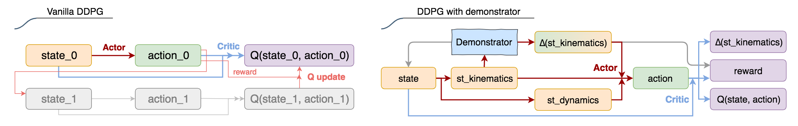
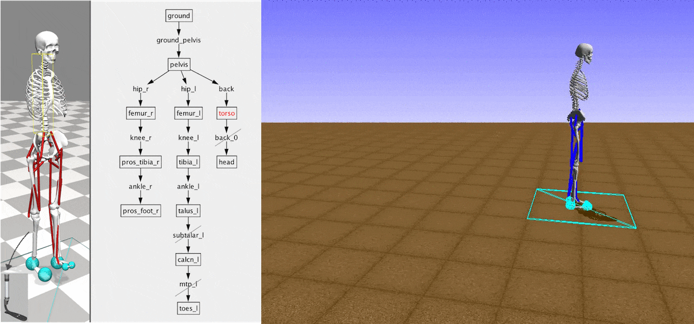

# Learn to Walk with a Prosthetic Leg

This is the project for the [CrowdAI competition](https://www.crowdai.org/challenges/nips-2018-ai-for-prosthetics-challenge) on [NeurIPS 2018: AI for Prosthetics Challenge](https://github.com/stanfordnmbl/osim-rl), to develop a controller for a human musculoskeletal model with a prosthetic leg to walk and run.

The **control model** is an Actor-Critic DDPG (Distributed Deep Deterministic Policy Gradients) network, based on the [implementation of OpenAI baselines](https://github.com/openai/baselines/tree/master/baselines/ddpg) in TensorFlow.

 

* **Demonstrator**: The demonstrator takes in current joint positions and outputs desired change of angles. It is pre-trained using supervised learning, with [normal gait kinematics](demo) as positive and interpolated 'extremely slow motion' as negative samples. The demonstrator also performs early termination by position range and [reference state initialization](https://bair.berkeley.edu/blog/2018/04/10/virtual-stuntman/#insights), to improve the direction of policy gradients.

* **Actor**: The actor learns hierarchical controls, i.e., change of joint positions and then muscle excitations. The position control is calculated by the demonstrator while the muscle control is the output of an inverse dynamic like function, with the input being state observations and desired change of joint positions. 

    A position-mimic penalty (like a control error) with a decaying weight is added to the environment reward, which changes the landscape of Q value function. The expectation is that the agent would learn to mimic the demonstrator as well as maximise the environment reward. This is similar to us learning a new sport by imitating experts, but our muscle controls are already trained through evolution.

    The training of muscle controls can be speed up by using agent's past experience with the actual change of positions as the position control input, which is similar to the idea of [Hindsight Experience Replay](https://arxiv.org/pdf/1707.01495.pdf). This is equivalent to the actor update, if the critic is accurate and Q value equals to single step position-mimic penalty.

* **Critic**: The critic predicts Q value and models transitions of key observation states. The assumption is that modelling transitions and the underlying physics to some extent helps shape low level features of Q value network, and a critic that understands the world better should make better predictions. Is there a potential conflict between modelling _accumulative_ reward and _single_ transition? Yes, but the Q value increases over time, and the critic gradually shifts learning towards modelling long-term return.

* **Sampling**: The action space is sampled using the one-variable-at-a-time method, to bootstrap the critic.

## How to run:
* Prerequisites: Python 3.6, [opensim 4.0](https://github.com/stanfordnmbl/osim-rl#getting-started), TensorFlow 1.9.
* To train the model on 4 cores: mpirun --use-hwthread-cpus -bind-to core -n 4 python main.py. 

## More on the simulation environment:
The [OpenSim environment](https://simtk.org/projects/opensim) models musculoskeletal systems and simulates excitation of muscles, joint torques, external forces (contact, friction, gravity) and body motions. 
* Action space: 19 muscle actuators of continuous value and 12 degrees of freedom. The number of actuators is bigger than DoF, because some muscles produce nearly opposing torques.
* Observation space: 415-dimensional (non-independent), continuous value of different scales.
* Simulation speed: ~0.2 second per simulation step (Intel Haswell 2.30GHz), ~1000 times slower than OpenAI Roboschool.

 
