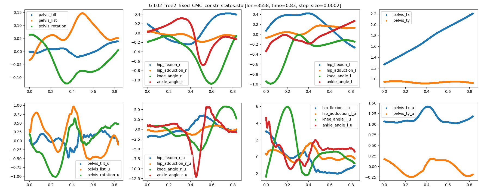

# Demo Data

## Data source
- [Multiple Speed Walking Simulations](https://simtk.org/projects/mspeedwalksims), containing models of different heights walking at four different speeds.
- [Stabilization of Walking by Intrinsic Muscle Properties](https://simtk.org/projects/muscleprops), containing 10-gait cycle simulation and results.

## Demo files
The data used to train demonstrator.
- reset_states.csv: data GIL02_free_speed. 
- range.csv: GIL02_free_speed + GIL02_swap_free_speed (GIL02_free_speed with left and right swapped).
- train_pos.csv: GIL02_free_speed + GIL02_swap_free_speed, step = 0.01 second.
- train_neg.csv: GIL02_free_speed, step = 0.25-2.5 ms.
- test0.csv: GIL02_free_speed, step = 0.01 s.
- test1.csv: GIL03_free_speed, step = 0.01 s.
- test2.csv: 10_GEIT, step = 0.01 s.

 
